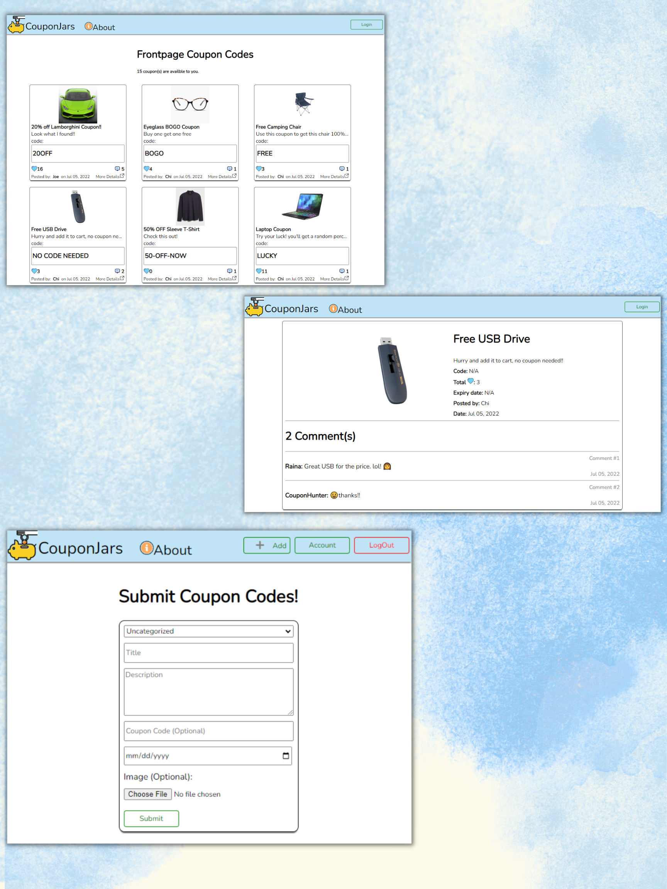

<div id="top"></div>

<!-- PROJECT LOGO -->
<br />
<div>
<h1 align="center">CouponJars</h1>


  <p align="center">
    CouponJars is a platform that allows users to submit and share their finds about coupon and deals to other users.
    <br />
    <a href="https://couponjars.netlify.app/"><strong>View Demo »</strong></a>
    <br />
    <br />
    <a href="https://github.com/ChiShingLi/CouponJars/tree/master/client">Frontend client Source Code</a>
    ·
    <a href="https://github.com/ChiShingLi/CouponJars/tree/master/server">Backend server Source Code</a>
  </p>
</div>


<!-- TABLE OF CONTENTS -->
<details>
  <summary>Table of Contents</summary>
  <ol>
    <li>
      <a href="#about-the-project">About The Project</a>
      <ul>
        <li><a href="#built-with">Built With</a></li>
      </ul>
    </li>
    <li>
      <a href="#getting-started">Getting Started</a>
      <ul>
        <li><a href="#installation">Installation</a></li>
      </ul>
    </li>
    <li><a href="#features">Features</a></li>
  </ol>
</details>

<br>

<!-- ABOUT THE PROJECT -->

**CouponJars** is a platform that allows users to submit and share their finds about coupon and deals to other users.





<p align="right">(<a href="#top">back to top</a>)</p>


### Built With
* ![React.js]
* ![Node.js]
* ![CSS]
* ![MongoDB]
* ![Express]
* ![Netlify]

<p align="right">(<a href="#top">back to top</a>)</p>

<!-- FEATURES -->
## Features

- User Signup
- User Login
- create post
- "Like" user's post
- Comment on user's post
- Change user password
- Change user display name/alias
- Coupon details page
<p align="right">(<a href="#top">back to top</a>)</p>

## Installation
1. Clone the repo
   ```sh
   git clone https://github.com/ChiShingLi/CouponJars.git
   ```
4. Install NPM packages
   ```sh
   npm install
   ```
5. Enter your API secrets in the `.env` file
   - **FrontEnd Client:**
   ```js
   REACT_APP_DATABASE_URL = "ENTER YOUR MONGODB DATABASE URL";
   ```

   - **Backend Client:**
   ```js
   PORT = "ENTER YOUR MONGODB DATABASE PORT NUMBER";

   DB_PATH = "ENTER YOUR MONGODB DATABASE CONNECTION STRING";

   JWT_SECRET = "ENTER YOUR JSON WEB TOKEN SECRET KEY";
   ```
<p align="right">(<a href="#top">back to top</a>)</p>

<!-- MARKDOWN LINKS & IMAGES -->
[React.js]: https://img.shields.io/badge/React-20232A?style=for-the-badge&logo=react&logoColor=61DAFB
[JQuery.com]: https://img.shields.io/badge/jQuery-0769AD?style=for-the-badge&logo=jquery&logoColor=white
[Node.js]: https://img.shields.io/badge/Node.js-43853D?style=for-the-badge&logo=node.js&logoColor=white
[CSS]:https://img.shields.io/badge/CSS3-1572B6?style=for-the-badge&logo=css3&logoColor=white
[MongoDB]:https://img.shields.io/badge/MongoDB-4EA94B?style=for-the-badge&logo=mongodb&logoColor=white
[Express]:https://img.shields.io/badge/Express.js-404D59?style=for-the-badge
[Netlify]:https://img.shields.io/badge/Netlify-00C7B7?style=for-the-badge&logo=netlify&logoColor=white
[Heroku]:https://img.shields.io/badge/Heroku-430098?style=for-the-badge&logo=heroku&logoColor=white
[JWT]:https://img.shields.io/badge/json%20web%20tokens-323330?style=for-the-badge&logo=json-web-tokens&logoColor=pink